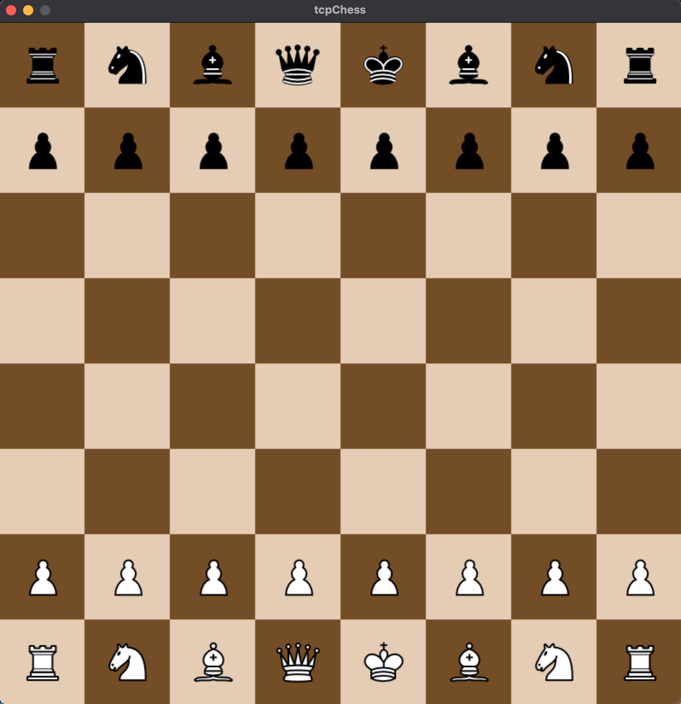
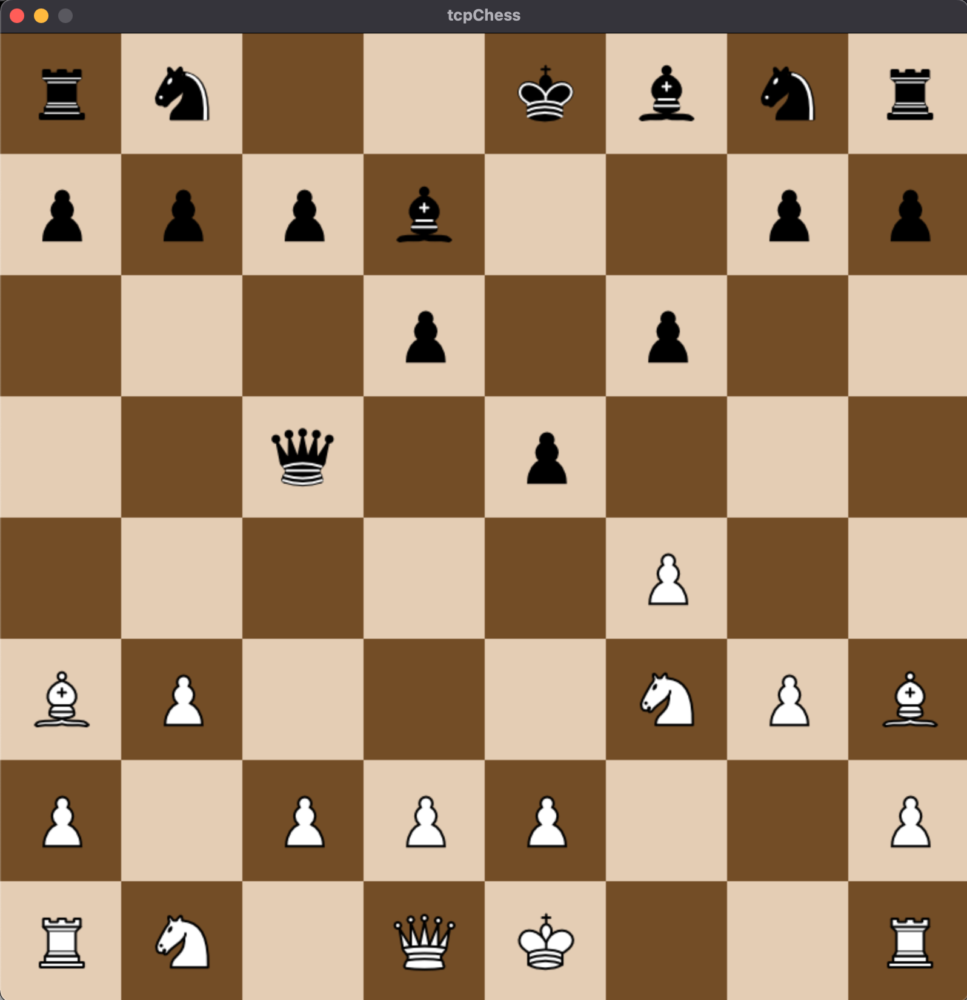

# Game-tcpChess
Tematem projektu jest gra w szachy stworzona w architekturze klient-serwer z użyciem protokołu TCP.

# Kompilacja i uruchomienie
Kompilację serwera można przeprowadzić np. poleceniem:<br>
```
gcc -Wall server.c -o server
```
Uruchomienie:<br>
```
./server
```
Do uruchomienia aplikacji klienckiej oprócz zainstalowanego pythona potrzebujemy także bibliotek pygame oraz chess.
Jeśli ich nie mamy, możemy zainstalować je korzystając z instalatora pip:
```
pip install pygame
pip install chess
```
Program uruchamiamy poleceniem:
```
python tcpChess.py localhost
```
w miejsce localhost wprowadzając adres serwera. Nie trzeba wprowadzać numeru portu, ponieważ jest on już przypisany w obu aplikacjach (nr. 4321).
Aby odpalić okno dla drugiego gracza należy w innym terminalu wpisać to samo polecenie.

# Screenshots
 
